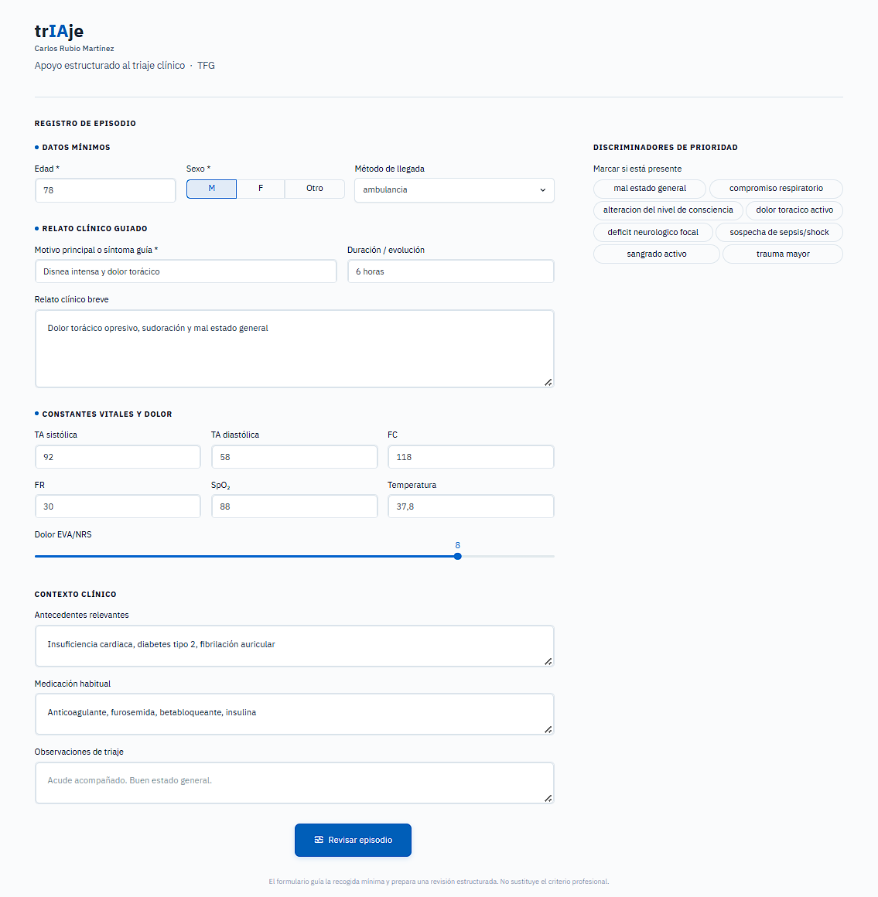
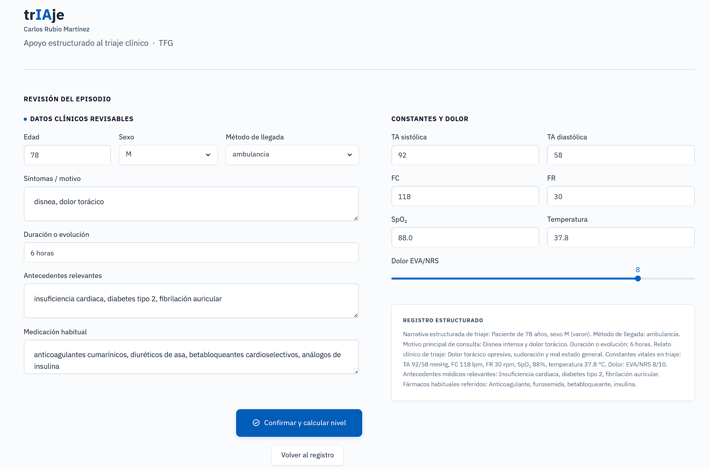
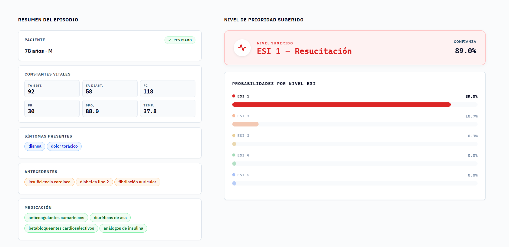
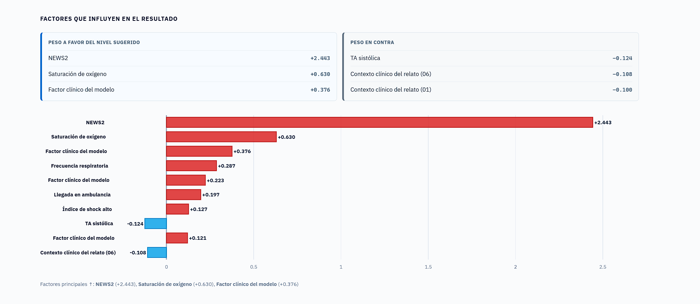
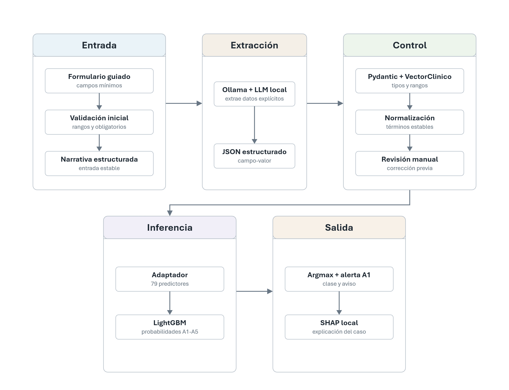
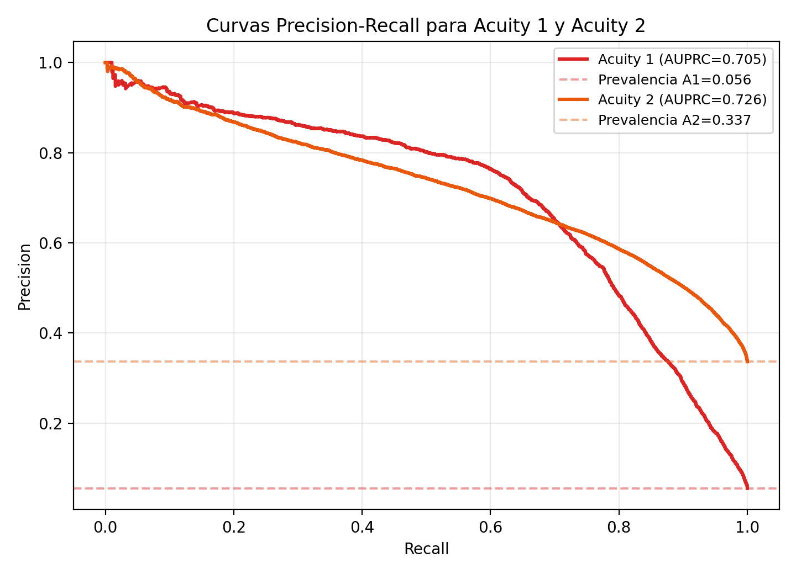
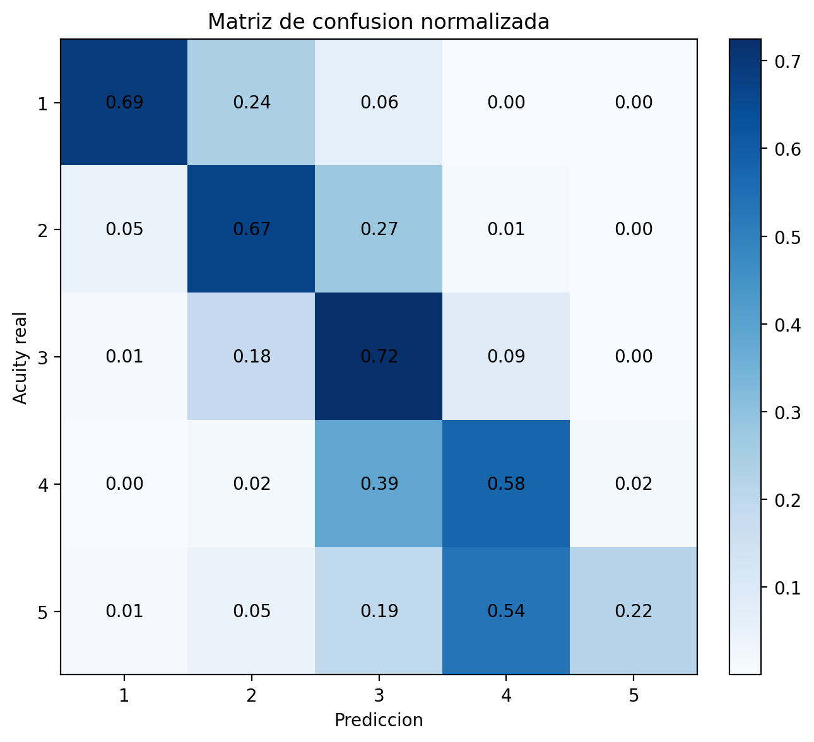
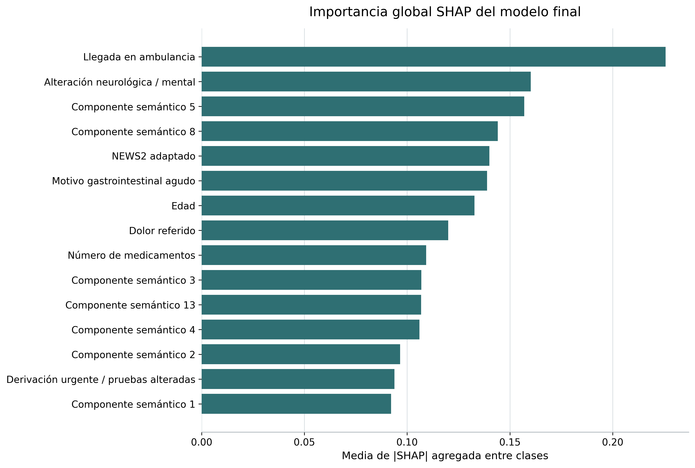

<div align="center">

# trIAje

### Sistema de gestión de emergencias en hospitales

**Trabajo Fin de Grado — Ingeniería Informática**<br>
Escuela Superior de Ingeniería Informática de Albacete · Universidad de Castilla-La Mancha

**Carlos Rubio Martínez · Junio de 2026**

Dirección: María Emilia Cambronero Piqueras<br>
Codirección: Manuel Fernández Ferrando y David Cebrian

</div>

> **Prototipo académico de apoyo a la decisión.** No es un producto sanitario ni
> debe utilizarse para tomar decisiones clínicas reales.

`trIAje` estudia cómo combinar modelos de lenguaje y aprendizaje automático para
apoyar la clasificación inicial de pacientes en urgencias. A partir de la
información introducida por el usuario, el sistema construye un registro clínico
estructurado, permite revisarlo y estima una distribución de probabilidad sobre
los cinco niveles ESI/Acuity.

El modelo de lenguaje no decide el nivel de triaje. Su función es transformar el
relato clínico en variables revisables. La predicción la realiza un modelo
LightGBM entrenado sobre MIMIC-IV-ED, y la interfaz muestra tanto la distribución
de probabilidades como los principales factores SHAP del resultado.

## Contenido

- [Qué aporta el proyecto](#qué-aporta-el-proyecto)
- [Aplicación](#aplicación)
- [Funcionamiento](#funcionamiento)
- [Metodología](#metodología)
- [Resultados](#resultados)
- [Estructura del repositorio](#estructura-del-repositorio)
- [Reproducir el proyecto](#reproducir-el-proyecto)
- [Notebooks y trazabilidad](#notebooks-y-trazabilidad)
- [Alcance y uso responsable](#alcance-y-uso-responsable)

## Qué aporta el proyecto

En este trabajo he desarrollado un flujo completo que conecta el desarrollo
experimental con una aplicación final ejecutable:

- extracción de información clínica desde texto libre mediante un LLM local o
  vía API;
- representación intermedia tipada mediante `VectorClinico` y Pydantic;
- normalización, validación y revisión manual antes de predecir;
- adaptación de la información disponible en la app a las 79 variables del
  modelo;
- clasificación multiclase con LightGBM y componentes semánticos BERT/SVD;
- explicación local de cada resultado mediante valores SHAP;
- alerta visual conservadora para casos con probabilidad relevante de Acuity 1;
- notebooks, auditorías, métricas y artefactos que permiten seguir las decisiones
  tomadas durante el proyecto.

La escala ESI/Acuity ordena la prioridad de atención desde el nivel 1, reservado
para los casos más críticos, hasta el nivel 5, correspondiente a los de menor
urgencia.

## Aplicación

La interfaz organiza el proceso en tres etapas: registro, revisión y resultado.
Las siguientes capturas corresponden al mismo caso sintético del capítulo 8 de
la memoria. No proceden de una historia clínica real.

### 1. Registro guiado del episodio

El usuario introduce el motivo de consulta, las constantes vitales, el dolor y
el contexto clínico disponible. Los discriminadores de prioridad se registran
de forma explícita cuando están presentes.



### 2. Revisión de la información extraída

El LLM convierte la narrativa en un `VectorClinico`. Antes de calcular el nivel,
el usuario puede corregir síntomas, antecedentes, medicación, constantes o
duración. La predicción nunca se ejecuta directamente sobre una extracción que
no haya pasado por esta pantalla de revisión.



### 3. Predicción probabilística

La salida presenta el nivel sugerido y las probabilidades de los cinco niveles
ESI. En el caso mostrado, el modelo asigna un 89,0 % de probabilidad a ESI 1.



### 4. Explicación del resultado

La explicación SHAP separa los factores que aumentan y reducen el soporte del
nivel sugerido. No constituye una explicación causal, pero permite comprobar
qué información ha tenido más peso en la inferencia.



## Funcionamiento



El recorrido de un episodio es el siguiente:

1. La interfaz construye una narrativa estable a partir del formulario.
2. El backend LLM extrae un JSON clínico estructurado.
3. Pydantic comprueba tipos y rangos; después se normalizan términos frecuentes
   y se generan avisos de coherencia.
4. El usuario confirma o corrige el `VectorClinico`.
5. El adaptador genera las variables tabulares disponibles en tiempo de
   inferencia.
6. Bio_ClinicalBERT representa el texto y el reductor SVD congelado obtiene 15
   componentes semánticos.
7. LightGBM calcula las probabilidades de Acuity 1 a 5.
8. La interfaz muestra la clase `argmax`, la distribución completa y la
   explicación SHAP.

La aplicación utiliza `argmax` como regla de decisión. Cuando
`P(Acuity 1) >= 0.40` y la clase sugerida no es ESI 1, muestra además una alerta
de seguridad. El aviso no modifica automáticamente la predicción.

## Metodología

### Datos y particionado

El desarrollo utiliza MIMIC-IV-ED, una base de datos de episodios de urgencias
disponible bajo acceso controlado en PhysioNet.

| Cohorte | Episodios | Uso |
|---|---:|---|
| Cohorte completa | 418.100 | Total tras aplicar los criterios del estudio |
| Desarrollo | 334.480 | Entrenamiento, validación agrupada y predicciones OOF |
| Prueba temporal | 83.620 | Evaluación final del modelo congelado |

El conjunto de prueba corresponde al tramo temporal final. La separación se
realiza por paciente para evitar que episodios de una misma persona aparezcan a
ambos lados del particionado. Los transformadores, la selección de variables y
los hiperparámetros se ajustan únicamente con datos de desarrollo.

### Variables y modelo final

El modelo final combina:

- **64 variables tabulares:** constantes vitales, escalas derivadas, motivo de
  consulta, llegada, medicación, antecedentes y señales clínicas;
- **15 componentes BERT/SVD:** representación compacta del texto clínico;
- **LightGBM multiclase:** salida probabilística para Acuity 1–5.

La configuración congelada se encuentra en
[`models/active_model.json`](models/active_model.json), y la lista exacta de
predictores en [`models/feature_list.json`](models/feature_list.json).

### Selección durante el desarrollo

La métrica principal de selección fue Macro F1 calculada mediante validación
cruzada agrupada y predicciones *out-of-fold*. El conjunto temporal de prueba no
se utilizó para escoger modelos, variables, umbrales ni calibración.

| Modelo de desarrollo | Macro F1 OOF |
|---|---:|
| `DummyClassifier` estratificado | 0,200 |
| Regresión logística base | 0,372 |
| LightGBM con 46 variables base | 0,487 |
| LightGBM final con BERT/SVD | 0,568 |

Los experimentos posteriores de optimización y clases minoritarias se conservan
como trazabilidad, pero no sustituyen al modelo final cuando no cumplen los
criterios de adopción definidos sobre OOF.

## Resultados

Los resultados siguientes proceden exclusivamente del conjunto temporal de
prueba final (`n = 83.620`), una vez congelado el modelo.

| Métrica | Valor |
|---|---:|
| Macro F1 | **0,560** |
| F1 ponderado | **0,697** |
| Balanced accuracy | **0,576** |
| AUPRC Acuity 1 | **0,705** |
| AUPRC Acuity 2 | **0,726** |
| Recall Acuity 1 | **0,691** |

<p align="center">
  
  
</p>

<details>
<summary><strong>Consultar métricas completas por clase</strong></summary>

| Clase | Precisión | Recall | F1 | Episodios |
|---|---:|---:|---:|---:|
| Acuity 1 | 0,658 | 0,691 | 0,674 | 4.648 |
| Acuity 2 | 0,665 | 0,668 | 0,667 | 28.149 |
| Acuity 3 | 0,766 | 0,725 | 0,745 | 45.391 |
| Acuity 4 | 0,415 | 0,577 | 0,483 | 5.264 |
| Acuity 5 | 0,247 | 0,220 | 0,233 | 168 |

</details>

### Interpretación global

La importancia SHAP agregada permite observar la contribución media de cada
variable entre las cinco clases. La llegada en ambulancia, las señales
neurológicas, los componentes semánticos, NEWS2 y distintos elementos del motivo
de consulta aparecen entre los factores con mayor peso global.



Los valores numéricos completos se encuentran en
[`reports/final_evaluation/`](reports/final_evaluation/) y las figuras finales en
[`reports/figures/final_evaluation/`](reports/figures/final_evaluation/).

## Estructura del repositorio

```text
triaje-ia-tfg/
├── src/triaje_ia/              Código fuente
│   ├── data/                   Carga, limpieza y features offline
│   ├── llm/                    Extracción, normalización y validación
│   ├── inference/              Adaptador y predictor de la aplicación
│   ├── ml/                     Pipeline, decisión y explicabilidad
│   └── ui/app.py               Interfaz Streamlit
├── notebooks/                  Desarrollo metodológico del TFG
├── prompts/                    Prompts del extractor clínico
├── models/                     Modelo activo, configuración y manifiesto
├── artifacts/                  Selección de características
├── reports/                    Métricas, auditorías y figuras finales
├── tests/                      Tests unitarios
├── pyproject.toml              Dependencias y configuración
└── uv.lock                     Entorno reproducible
```

Rutas especialmente útiles para revisar el proyecto:

| Contenido | Ruta |
|---|---|
| Aplicación principal | [`src/triaje_ia/ui/app.py`](src/triaje_ia/ui/app.py) |
| Esquema `VectorClinico` | [`src/triaje_ia/llm/schemas.py`](src/triaje_ia/llm/schemas.py) |
| Adaptador de inferencia | [`src/triaje_ia/inference/adapter.py`](src/triaje_ia/inference/adapter.py) |
| Predictor final | [`src/triaje_ia/inference/predictor.py`](src/triaje_ia/inference/predictor.py) |
| Política de decisión | [`src/triaje_ia/ml/decision.py`](src/triaje_ia/ml/decision.py) |
| Explicabilidad | [`src/triaje_ia/ml/explicabilidad.py`](src/triaje_ia/ml/explicabilidad.py) |
| Resultados finales | [`reports/final_evaluation/`](reports/final_evaluation/) |
| Auditorías del LLM | [`reports/auditorias_finales/`](reports/auditorias_finales/) |
| Selección de características | [`artifacts/`](artifacts/) |

## Reproducir el proyecto

### Requisitos

- Python 3.11 o superior.
- [`uv`](https://docs.astral.sh/uv/) como gestor del entorno.
- Ollama para la extracción local, o credenciales para el backend API.
- Conexión a Internet en la primera carga de Bio_ClinicalBERT si el modelo no
  está ya en caché.

### Instalación

```bash
git clone https://github.com/CarlosRubM/triaje-ia-tfg.git
cd triaje-ia-tfg
uv sync
```

Para instalar también las herramientas de desarrollo y ejecutar los tests:

```bash
uv sync --group dev
```

### Configuración del extractor LLM

Copiar `.env.example` como `.env`. Este último archivo es local y está excluido
de Git.

Para el backend recomendado en local:

```text
LLM_BACKEND=ollama
```

```bash
ollama pull llama3.1:8b-instruct-q4_K_M
ollama serve
```

También puede utilizarse `LLM_BACKEND=api` con la configuración indicada en
[`.env.example`](.env.example).

### Ejecutar la aplicación

```bash
uv run streamlit run src/triaje_ia/ui/app.py
```

El clasificador y el reductor final están incluidos en:

```text
models/lgbm_bert_final.joblib
data/processed/bert_svd.joblib
```

Sus tamaños y hashes SHA-256 están registrados en
[`models/artifact_manifest.json`](models/artifact_manifest.json). La
configuración restante se carga desde `models/active_model.json`.

### Ejecutar los tests

```bash
uv run pytest tests/ -v
```

## Notebooks y trazabilidad

Los notebooks conservan sus salidas para que puedan revisarse los resultados
obtenidos durante el desarrollo.

<details>
<summary><strong>Ver los 14 notebooks del proyecto</strong></summary>

| Fase | Notebook | Finalidad |
|---|---|---|
| Comprensión | [`01_data_exploration.ipynb`](notebooks/1_data_understanding/01_data_exploration.ipynb) | Exploración de MIMIC-IV-ED |
| Comprensión | [`02_loader_validation.ipynb`](notebooks/1_data_understanding/02_loader_validation.ipynb) | Validación de carga y uniones |
| Preparación | [`03_cleaning_analysis.ipynb`](notebooks/2_data_preparation/03_cleaning_analysis.ipynb) | Análisis de limpieza |
| Preparación | [`04_cleaner_validation.ipynb`](notebooks/2_data_preparation/04_cleaner_validation.ipynb) | Validación del proceso de limpieza |
| Preparación | [`05_feature_engineering.ipynb`](notebooks/2_data_preparation/05_feature_engineering.ipynb) | Construcción de variables |
| Preparación | [`05b_feature_validation.ipynb`](notebooks/2_data_preparation/05b_feature_validation.ipynb) | Selección y validación final |
| Modelado | [`06_nlp_feature_extraction.ipynb`](notebooks/3_modeling/06_nlp_feature_extraction.ipynb) | Variables LLM y BERT/SVD |
| Modelado | [`07_model_training.ipynb`](notebooks/3_modeling/07_model_training.ipynb) | Comparación, OOF y modelo final |
| Modelado | [`07b_lgbm_bert_optuna_tuning.ipynb`](notebooks/3_modeling/07b_lgbm_bert_optuna_tuning.ipynb) | Optimización Optuna documentada |
| Modelado | [`07c_lgbm_bert_tail_class_tuning.ipynb`](notebooks/3_modeling/07c_lgbm_bert_tail_class_tuning.ipynb) | Estudio de clases minoritarias |
| Evaluación | [`08_model_evaluation.ipynb`](notebooks/4_evaluation/08_model_evaluation.ipynb) | Evaluación temporal final |
| Evaluación | [`09_llm_extraction_validation.ipynb`](notebooks/4_evaluation/09_llm_extraction_validation.ipynb) | Validación de extracción clínica |
| Auditoría | [`10_llm_production_flow_audit_v3.ipynb`](notebooks/4_evaluation/10_llm_production_flow_audit_v3.ipynb) | Auditoría extremo a extremo |
| Auditoría | [`11_llm_minimum_information_audit_v3.ipynb`](notebooks/4_evaluation/11_llm_minimum_information_audit_v3.ipynb) | Calidad según información disponible |

</details>

Los experimentos complementarios 07b, 07c, 10 y 11 están citados en la memoria
y se mantienen con sus salidas como parte de la trazabilidad del trabajo. Los
resultados de casos sintéticos no se presentan como validación clínica.

## Qué se versiona

El repositorio incluye el código, los 14 notebooks con sus resultados, los
tests, los prompts, las métricas, las figuras, los artefactos de selección de
características y los dos artefactos congelados necesarios para ejecutar la
aplicación.

No se incluyen los datos originales de MIMIC-IV-ED, los parquets intermedios de
trabajo, credenciales, cachés ni modelos experimentales sustituidos. El acceso a
MIMIC-IV-ED está sujeto a las condiciones de PhysioNet.

## Alcance y uso responsable

- El proyecto demuestra la viabilidad técnica de un flujo híbrido LLM + ML; no
  ha sido validado como dispositivo sanitario.
- El usuario revisa la información extraída antes de calcular la predicción.
- Las explicaciones SHAP describen el comportamiento del modelo, pero no
  establecen causalidad clínica.
- La alerta A1 es un mecanismo visual de apoyo y no reemplaza el juicio de un
  profesional.
- No se almacenan ni versionan datos de pacientes en el repositorio.

## Autoría

Proyecto desarrollado por **Carlos Rubio Martínez** como Trabajo Fin de Grado en
la Escuela Superior de Ingeniería Informática de Albacete, Universidad de
Castilla-La Mancha.
