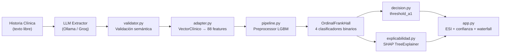

# trIAje — Sistema Híbrido LLM + ML para Triaje de Urgencias

> **Trabajo Fin de Grado** · Grado en Ingeniería Informática · Curso 2024/2025

Sistema de apoyo a la decisión clínica (CDSS) que combina un **LLM** para la extracción
semántica de variables clínicas desde texto libre, con un **modelo ordinal LightGBM**
entrenado sobre [MIMIC-IV-ED](https://physionet.org/content/mimic-iv-ed/) para predecir
el nivel de urgencia ESI (1–5).

> ⚠️ **Disclaimer ético**: Este sistema es un prototipo académico. **No debe usarse para
> tomar decisiones clínicas reales**. No ha sido validado externamente ni certificado para
> uso sanitario.

---

## Arquitectura



### Flujo de datos

1. **Extracción LLM**: El usuario introduce una narrativa clínica. Un LLM (Ollama local o Groq cloud) extrae variables estructuradas (`VectorClínico`).
2. **Validación**: Se verifican incoherencias semánticas (PA invertida, temperatura vs texto, etc.).
3. **Adaptación**: `adapter.py` convierte el `VectorClínico` en un DataFrame con las 88 features MIMIC-IV-ED.
4. **Inferencia**: El modelo `OrdinalFrankHall(LGBMClassifier)` predice `P(acuity=k)` para `k=1..5`.
5. **Decisión**: Política de seguridad `threshold_a1`: si `P(acuity=1) ≥ 20%`, se asigna ESI 1.
6. **Explicabilidad**: SHAP waterfall muestra las features más influyentes.

---

## Estructura del repositorio

```
triaje-ia-tfg/
├── src/triaje_ia/
│   ├── data/              # loader, cleaner, features (88 features)
│   ├── ml/                # pipeline, ordinal, inferencia, decision, explicabilidad
│   ├── llm/               # extractor (Ollama), extractor_api (Groq), factory, validator, schemas
│   ├── inference/         # adapter (VectorClínico → features MIMIC)
│   └── ui/                # app.py (Streamlit)
├── notebooks/
│   ├── 1_data_understanding/
│   ├── 2_data_preparation/
│   ├── 3_modeling/        # 06_modeling.ipynb (entrenamiento ordinal)
│   └── 4_evaluation/      # 07_improvements_evaluation.ipynb
├── models/                # lgbm_ordinal.joblib, MODEL_CARD.md
├── prompts/               # System prompts para LLM
├── tests/                 # 46 tests unitarios
├── pyproject.toml         # Dependencias (uv)
└── Dockerfile             # Deploy Railway
```

---

## Instalación

### Requisitos previos

- Python ≥ 3.11
- [uv](https://docs.astral.sh/uv/) (gestor de paquetes)
- [Ollama](https://ollama.ai/) (para LLM local) **o** API key de [Groq](https://groq.com/) (para cloud)

### Setup

```bash
# Clonar el repositorio
git clone https://github.com/<tu-usuario>/triaje-ia-tfg.git
cd triaje-ia-tfg

# Instalar dependencias
uv sync

# (Opcional) Instalar dependencias de desarrollo
uv sync --group dev
```

### Configurar LLM

**Opción A — Ollama local (desarrollo):**
```bash
# Instalar Ollama y descargar un modelo
ollama pull llama3.2
ollama serve  # dejar corriendo
```

**Opción B — Groq API (cloud / deploy):**
```bash
cp .env.example .env
# Editar .env con tu GROQ_API_KEY
```

---

## Uso

### Ejecutar la app Streamlit

```bash
uv run streamlit run src/triaje_ia/ui/app.py
```

### Ejecutar los tests

```bash
uv run pytest tests/ -v
```

### Entrenar el modelo (requiere MIMIC-IV-ED)

1. Seguir los notebooks `01` a `05` para preparar los datos.
2. Ejecutar `notebooks/3_modeling/06_modeling.ipynb` para entrenar y exportar `models/lgbm_ordinal.joblib`.

---

## Modelo

- **Arquitectura**: `OrdinalFrankHall(LGBMClassifier)` — 4 clasificadores binarios (Frank & Hall, 2001).
- **Features**: 88 variables derivadas de signos vitales, datos demográficos, medicación, chief complaint, historial ED y comorbilidades CCS.
- **Dataset**: MIMIC-IV-ED (Medical Information Mart for Intensive Care, Emergency Department).
- **Política de seguridad**: `threshold_a1` — si `P(acuity=1) ≥ 0.20`, se asigna ESI 1 independientemente del argmax.

Ver [`models/MODEL_CARD.md`](models/MODEL_CARD.md) para métricas y limitaciones.

---

## Limitaciones conocidas

- `ccs_category` se extrae de diagnósticos registrados durante o tras el episodio (data leakage temporal).
- Las regex de chief complaint están calibradas para el vocabulario de MIMIC-IV-ED (inglés).
- En producción, el historial ED del paciente no está disponible — se usan defaults conservadores.
- El modelo no ha sido validado externamente en poblaciones distintas a MIMIC-IV-ED.

---

## Licencia

Proyecto académico — TFG curso 2024/2025.
